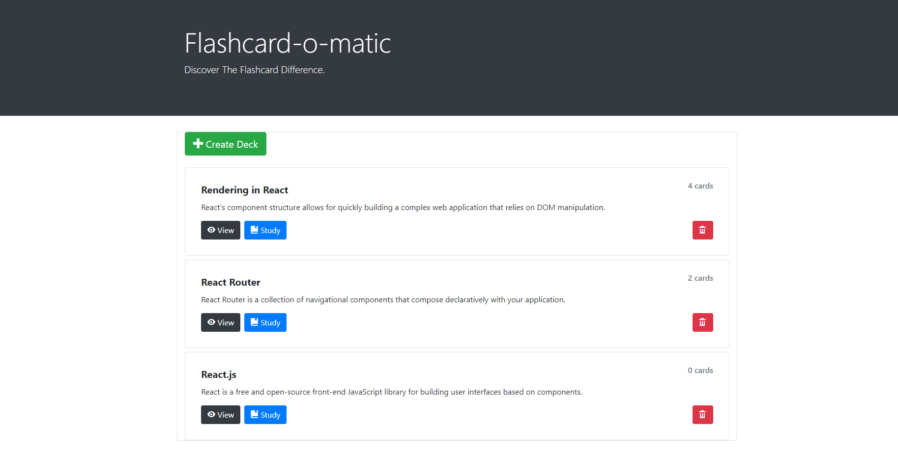

# Project: Flashcard-o-matic

Live site: https://study-flashcard.onrender.com/

## Description
A flashcard application, Flashcard-o-matic, to help the students study online. Users will use this application to create decks of flashcards for the subjects they study. 

## Techonology Used
 - Implemented react router and express to build a RESTful API.
 - Used Git to track changes and versions while keeping sensitive information from being pushed to repositories.
 - Used bootstrap to styling the webpage.
 

## Installation instructions
1. Run npm install to install project dependencies.
2. Run npm run start to start your server in development mode.

